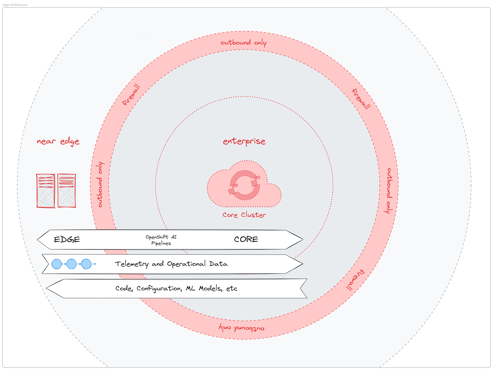

# Open Data Hub / AI Edge

As the adoption of AI and ML continues to surge, there's an increasing demand to deploy these workloads in edge
environments such as factories, farms, and remote locations where traditional computing infrastructure is limited,
connectivity is unreliable or constrained, and reliability is paramount.

This repository contains tools and artifacts comprising a proof of concept to bring the power of Open Data Hub and
OpenShift AI to such edge environments.

> [!WARNING]
> This is a proof of concept repository and is not intended for production use. The edge features are experimental and
> the repository is under active development.

## Overview

The term edge is a highly overloaded term in the industry. For the purpose of this repository, the following diagram
illustrates the concept of core and near edge environments.



### Terminology

- **Core**
  - The central OpenShift cluster that is used to manage the edge clusters.
  - Can be an on-premise or cloud-based cluster.
  - There are no resources or network constraints expected in the core cluster.
- **Near Edge**
  - This is an edge environment to run and serve AI/ML inference workloads.
  - For the purpose of this repository, the near edge environment is represented by separate OpenShift cluster(s)
    managed from the core OpenShift cluster.
  - The near edge environment is expected to have moderate yet constrained compute resources and network.
  - Doesn't necessarily have any open ports for inbound connections.

### Use Case

The main objective currently is to showcase that a user can:

1. Package an inference service by integrating a trained model with all required dependencies into a container image,
   ensuring it's ready for utilization at the near edge location(s) in a streamlined manner.
1. Centrally control and manage the set of target near edge environments from the core OpenShift cluster, and configure
   the initialization of a GitOps workflow on each of those targets.
1. Utilize GitOps tooling at each near edge environment to reconcile the manifests specified in the GitOps repository
   (managed centrally), and deploy the inference service.
1. Monitor and observe the deployed AI/ML inference workloads in the near edge environments from the core OpenShift
   cluster.

> [!NOTE]
> Developing and training a model is currently out of scope of this repository as this repository already
contains example models in the [pipelines/models/](pipelines/models/) directory. You can read more about developing
> and training a model in the [Developing and training a model](#developing-and-training-a-model) section.


### Architecture: A Bird's Eye View

The diagram above illustrates the architecture of the proof of concept. The two main categories of clusters are the core
and near edge clusters.

#### Core Cluster
- Packages different types of AI/ML models and serving runtimes into container images using
  `Red Hat OpenShift Pipelines`[^1].
- Manages the near edge clusters and the AI/ML inference deployed on them in a GitOps manner using
  `Red Hat Advanced Cluster Management for Kubernetes (ACM)`[^2] and `Red Hat OpenShift GitOps`.
- Monitors and observes the deployed AI/ML inference workloads in the near edge environments using `ACM` and
  `Red Hat OpenShift Observability`[^3].
- Hosts the Open Data Hub and OpenShift AI components.

#### Near Edge Cluster(s)
- Run the AI/ML workloads as defined by the core cluster in a GitOps manner using `ACM`and `Red Hat OpenShift GitOps`.
- Continuously reconcile the state of the AI/ML workloads with the core cluster using
  [ACM's pull model with ArgoCD](https://access.redhat.com/documentation/en-us/red_hat_advanced_cluster_management_for_kubernetes/2.9/html/gitops/gitops-overview#gitops-push-pull).
- Collect metrics of the AI/ML workloads and send them to the core cluster using `Red Hat OpenShift Observability` and
  `ACM`.

## Preparing the Infrastructure

Before you can start using the proof of concept, you need to prepare the infrastructure. This includes setting up the
OpenShift clusters and installing the required components.

Follow the steps in [Preparing the Infrastructure](./docs/preparing_the_infrastructure.md) to set up the infrastructure.


## Proof of Concept Walkthrough


The proof of concept is built to provide two main workflows as shown in the diagram above

### Workflow 1: Building an Inference Application Container Image

In [pipelines/README.md](pipelines/README.md) we show how to take the trained models,
store them in a S3 bucket,
build container image(s) with the model and serving runtime using OpenShift Pipelines,
push the container image(s) to an image registry accessible by the near edge cluster(s),
and update a clone of this repository with a pull request,
configuring `acm/odh-edge/apps/*/kustomization.yaml` with location and digest (SHA-256) of the built images.

You can skip this step if you do not wish to rebuild the container images.
If you use the default configuration as shown in this git repository,
you will use already built container images from the https://quay.io/organization/rhoai-edge repositories.

### Workflow 2: Deploying and Updating an Inference Application on Near Edge Clusters

With the remote near edge clusters now available in the cluster set and the argocd, it is now possible to deploy the
applications to those clusters using the Argo CD Pull model integration in [ACM GitOps](https://access.redhat.com/documentation/en-us/red_hat_advanced_cluster_management_for_kubernetes/2.9/html/gitops/index).

We will create the objects in the respective namespaces from the `acm/registration/` directory structure.

However, it is important to note that the actual application configuration, stored in `acm/odh-edge/`,
does not come from our local git repository checkout.
Instead, [`acm/registration/near-edge/overlays/tensorflow-housing-app/kustomization.yaml`](acm/registration/near-edge/overlays/tensorflow-housing-app/kustomization.yaml)
and [`acm/registration/near-edge/overlays/bike-rental-app/kustomization.yaml`](acm/registration/near-edge/overlays/bike-rental-app/kustomization.yaml)
contain source URLs of the git repositories that will become configurations of the ACM Channels,
and the applications in those remote git repositories will be deployed.
By default, [github.com/opendatahub-io/ai-edge](https://github.com/opendatahub-io/ai-edge) is configured;
edit the URLs to match your repositories.

Then, as a user with permissions to create/update the following resource types in the `openshift-gitops` namespace on
the ACM hub cluster:

``` text
ApplicationSets
GitOpsClusters
ManagedClusterSetBindings
PlacementBindings
Placements
Policies
```

run the following command:
```bash
oc apply -k acm/registration/
```

##### Credentials for private repositories

If the GitOps repository that Argo CD on the edge clusters will deploy resources from requires some form of credentials,
then these credentials will need to be provided to each cluster via a Secret.
This can be done by specifying the Secret inside an ACM Policy resource on the ACM hub cluster in such a way that ACM
will instruct the edge clusters to create it.
The following example illustrates how this may be done:
```sh
cat << EOF | oc apply -f -
apiVersion: policy.open-cluster-management.io/v1
kind: Policy
metadata:
  name: namespace-policy
  namespace: openshift-gitops
spec:
  disabled: false
  policy-templates:
    - objectDefinition:
        apiVersion: policy.open-cluster-management.io/v1
        kind: ConfigurationPolicy
        metadata:
          name: ensure-namespace-exists
        spec:
          object-templates:
            - complianceType: musthave
              objectDefinition:
                apiVersion: v1
                kind: Secret
                metadata:
                  name: first-repo
                  namespace: openshift-gitops
                  labels:
                    argocd.argoproj.io/secret-type: repository
                stringData:
                  type: git
                  url: https://github.com/argoproj/private-repo
          pruneObjectBehavior: DeleteIfCreated
          severity: low
          remediationAction: enforce
EOF
```


### View the application deployments
#### ACM

In the OpenShift Console of the ACM hub cluster in All Clusters > Applications, search for the application name.
You should see a few results results: `<app name>-appset`, `<cluster name>-<app name>`, and `<app name>-1`.
Clicking on the `<cluster name>-<app name>` entry, and then navigating to the Topology tab, you can see what objects
were created on the remote cluster.

Everything should be shown green. If it is not, click the icon of the faulty object and check the displayed information
for debugging clues.

#### Argo CD

The Argo CD provided by Openshift GitOps has a console on each near edge cluster, showing detailed information on each
application that it manages on that cluster. On the particular edge cluster, open the console by navigating to the
domain specified by the `openshift-gitops-cluster` Route in the `openshift-gitops` namespace on that cluster. Once
logged-in to the Argo console, search for the application name, and then select the entry named in the format `<cluster
name>-<application name>` to see more information.

### Observability setup

* Edge cluster(s)
  * Login to the edge cluster using an account with cluster-admin privileges
  * Enable [monitoring for user-defined projects](https://access.redhat.com/documentation/en-us/openshift_container_platform/4.13/html/monitoring/enabling-monitoring-for-user-defined-projects) in OpenShift clusters
    * `oc -n openshift-monitoring edit configmap cluster-monitoring-config`
    * Set variable `enableUserWorkload` to `true`
* Core/Hub cluster
  * Edit contents of [thanos-secret](acm/odh-core/acm-observability/secrets/thanos.yaml) file.
  * Install the ACM observability stack by running `make install`

### Developing and training a model

This step is out of scope of this Proof of Concept repository,
as this repository already contains trained models in the [pipelines/models/](pipelines/models/) directory.

If you wish to develop and train different models,
Jupyter notebooks provided by [Open Data Hub](https://opendatahub.io/) (ODH)
or [Red Hat OpenShift AI](https://www.redhat.com/en/technologies/cloud-computing/openshift/openshift-ai) can be used.
To install ODH or OpenShift AI operators, admin privileges in the OpenShift cluster are needed.

Working and deploying your own models might require bigger changes
to the definition and configuration of the pipelines and ACM setup below,
so you might want to start with the pre-built models first.

### Using local models in pipelines

In `pipelines/model-upload/` you can upload a local
model file to be used in our pipelines. This is done by uploading a model to a PVC
and copying that model to our pipeline's workspace for use while it is running.

Upload model to PVC:
```bash
make MODEL_PATH="PATH_TO_A_FILE" NAME=my-model create
```
You should get a final output showing details of the upload
```
PVC name: model-upload-pvc
Size: 1G
Model path in pod: /workspace/model-upload-pvc/model_dir/model.model
```
You can set the `SIZE` and `PVC` values aswell
```bash
make MODEL_PATH="PATH_TO_A_FILE" NAME=my-model SIZE=1G PVC=my-new-PVC create
```

You can then use the [copy-model-from-pvc](pipelines/tekton/aiedge-e2e/tasks/copy-model-from-pvc.yaml) task to copy the
model from the `model-workspace`, which can be set to the PVC created in the last step, to the `build-workspace-pv`
workspace, which is then used by the `buildah` task in the pipeline.
[copy-model-from-pvc](pipelines/tekton/aiedge-e2e/tasks/copy-model-from-pvc.yaml) task is not included in the pipeline
by default, you have to add it yourself.

## Contributing

See [CONTRIBUTING.md](CONTRIBUTING.md).

## Development

See [DEVELOPMENT.md](DEVELOPMENT.md).

[^1]: https://www.redhat.com/en/technologies/cloud-computing/openshift/pipelines
[^2]: https://www.redhat.com/en/technologies/management/advanced-cluster-management
[^3]: https://www.redhat.com/en/technologies/cloud-computing/openshift/observability
