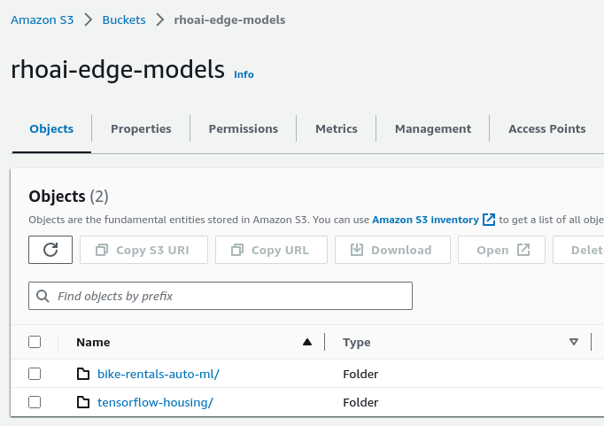

# Pipelines Setup

## Models

These pipelines come with the following trained example MLflow models: [bike-rentals-auto-ml](models/bike-rentals-auto-ml/) and [tensorflow-housing](models/tensorflow-housing/):

```plaintext
bike-rentals-auto-ml/
├── conda.yaml
├── MLmodel
├── model.pkl
├── python_env.yaml
└── requirements.txt

tensorflow-housing/
├── conda.yaml
├── MLmodel
├── model.pkl
├── python_env.yaml
├── requirements.txt
└── tf2model/
    ├── saved_model.pb
    └── ...
```

## Prerequisites

- Trained AzureML model including MLflow environment (see above)
- OpenShift cluster with [OpenShift Pipelines Operator](https://docs.openshift.com/container-platform/4.13/cicd/pipelines/installing-pipelines.html) installed
- OpenShift project / namespace. E.g.  `oc new-project azureml-model-to-edge`
- A repository on [Quay.io](https://quay.io/)
- S3 bucket for storing the models
- A clone of this repository

## Deploy AzureML Container build pipeline

### Provide S3 credentials

After creating the S3 bucket and uploading the models  (see above), fill out `aws-env.yaml` and create the secret:



```bash
oc create -f tekton/azureml-container-pipeline/aws-env.yaml
```

### Deploy and run the build pipeline

> **NOTE**
> Make sure to change the `aws-bucket-name` parameter to match your AWS bucket name if using one of the provided `PipelineRun` files.

```bash
oc apply -k tekton/azureml-container-pipeline/
oc create -f tekton/azureml-container-pipeline/azureml-container-pipelinerun-tensorflow-housing.yaml
```

## Deploy Test MLflow Container image pipeline

### Quay Repository and Robot Permissions

- Create a repository, add a robot account to push images and set write Permissions for the robot on the repository.
- Download `build-secret.yml`
- Apply build-secret. E.g.:

```bash
oc apply -f <downloaddir>/rhoai-edge-build-secret.yml
oc secret link pipeline rhoai-edge-build-pull-secret
```

### Deploy and run the test pipeline

> **NOTE**
> Make sure to change the `target-imagerepo` parameter to match the name of your Quay namespace if using one of the provided `PipelineRun` files.

```bash
oc apply -k tekton/test-mlflow-image-pipeline/
oc create -f tekton/test-mlflow-image-pipeline/test-mlflow-image-pipelinerun-tensorflow-housing.yaml
```

## Deploy the GitOps pipeline

### Git Repository and Credentials

- Clone/Mirror this repository on your Git server
- Change the provided `gitops-git-user-` files to match your Git credentials

### Deploy the GitOps pipeline

```bash
oc apply -k tekton/gitops-update-pipeline/
```

#### Run the GitOps pipeline

The pipeline can be run through the OpenShift Pipelines web console, by specifying all of the details for your environment.

Alternatively, the `tekton/gitops-update-pipeline/example-pipelineruns/` contains some examples that can be modified and used.
In these examples, notice that there are Secrets containing Git credentials that are referenced by different tasks.
Create an equivalent Secret with appropriate details for your environment, and change the parameter values in the PipelineRun definition to match.
The examples use a Gitea server deployed to the core, but any equivalent Git forge that has the same pull request API (e.g. GitHub) should work too.

``` bash
# Bike rentals app
oc apply -f tekton/gitops-update-pipeline/example-pipelineruns/gitea-edge-user-1-secret.yaml
oc create -f tekton/gitops-update-pipeline/example-pipelineruns/gitops-update-pipelinerun-bike-rentals.yaml

# Tensorflow housing app
oc apply -f tekton/gitops-update-pipeline/example-pipelineruns/gitea-edge-user-2-secret.yaml
oc create -f tekton/gitops-update-pipeline/example-pipelineruns/gitops-update-pipelinerun-tensorflow-housing.yaml
```
